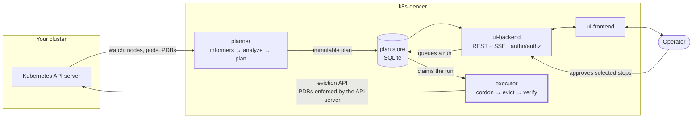

# k8s-dencer

[](https://github.com/atedgimo/k8s-dencer/actions/workflows/ci.yml)
[](LICENSE)
[](go.mod)
[](charts/k8s-dencer/Chart.yaml)

**Node consolidation for Kubernetes, with the decision left to you.**

k8s-dencer works out which nodes your cluster could give back, explains what
moving each workload would cost, and waits for a human to approve it.

---

## The problem

Most clusters run at a fraction of what they are paying for. The pods are spread
across more nodes than they need, and nothing moves them, because moving them
safely means reasoning about PodDisruptionBudgets, topology spread, affinity
rules, taints and single-replica workloads all at once.

The existing answers are autonomous. Karpenter consolidates and the Descheduler
evicts, both on their own schedule. That is the right design for a great many
teams — and unacceptable for the ones running workloads where an unplanned
eviction is an incident, who need to know in advance exactly which pods move and
what could go wrong.

**k8s-dencer produces the plan and stops.** It is a decision-support tool that
happens to be able to execute, not an autoscaler with a UI.

## What it does

- **Reads the whole constraint picture** — PDBs, topology spread, pod and node
  affinity, taints and tolerations, controller ownership, local storage — and
  tells you *why* any given pod cannot move, in words.
- **Plans a consolidation** as an ordered list of discrete steps, each one
  draining a single node.
- **Rates every step Green, Yellow or Red** with the reasoning attached, so the
  risky ones are visible before anyone clicks anything.
- **Executes only what you pick**, through the Kubernetes eviction API, so the
  API server itself enforces your PodDisruptionBudgets.
- **Refuses steps that became unsafe** between planning and execution, naming
  the rule that stopped it.
- **Answers questions in natural language** through an optional Kagent agent
  that quotes the analyzer rather than re-deriving anything.

**Execution is off by default.** Until you set `executor.enabled=true`, no
component in the release can cordon, evict, or write to a node — and `make lint`
fails the build if `pods/eviction` appears on any role but the executor's.

## How it works



Four workloads, deliberately separated:

| Component | Does | Can it change your cluster? |
|---|---|---|
| **planner** | Watches state, analyzes constraints, produces plans | No — read-only |
| **ui-backend** | Serves the API, authenticates and authorizes every request | No — read-only |
| **ui-frontend** | The operator's view | No |
| **executor** | Cordons and evicts, one step at a time | **Yes** — and only when enabled |

**The component reachable over the network cannot evict; the one that can evict
has no Service.** The executor is unreachable from outside the cluster by
construction rather than by configuration, and chart lint assertions hold both
halves of that in place.

The domain model has no Kubernetes imports at all, which is why the planner can
be tested against a YAML snapshot and benchmarked at 50,000 pods with no cluster
running.

## Quick start

**Prerequisites:** a Kubernetes cluster, Docker, Helm 3.8+, Go 1.26+, Node 22+.

No real workloads required — the demo stands up a fabric of fake nodes with
[KWOK](https://kwok.sigs.k8s.io/).

```bash
make demo     # fake-node fabric + 30-node topology + build images + install
make token    # mint an operator token; the UI asks for one
make ui       # port-forward and print the URL
```

Then open the printed URL. To clean up:

```bash
make fabric-reset   # uncordon every fake node after an executor run
make down           # remove every release this repo installs
```

`make` with no target lists everything. Full detail in
**[docs/install.md](docs/install.md)**.

## Installing on a real cluster

```bash
helm install k8s-dencer oci://ghcr.io/atedgimo/charts/k8s-dencer \
  --namespace k8s-dencer --create-namespace \
  --set auth.enabled=true
```

> **Not published yet.** The release pipeline is in place but no version has been
> tagged, so the OCI chart and its images do not exist. Until then, install from
> a checkout with `make deploy`. See
> [docs/development.md](docs/development.md).

Execution stays off unless you ask for it, and the chart refuses to enable it
without authentication and persistence:

```bash
--set executor.enabled=true --set auth.enabled=true --set persistence.enabled=true
```

## Safety model

The reason to trust this with a production cluster is that the dangerous parts
are narrow, explicit, and tested.

- **Eviction, never deletion.** Steps go through the `policy/v1` eviction
  subresource, so PodDisruptionBudgets are enforced by the API server rather than
  by code in this repository. The executor is deliberately not granted
  `delete pods`.
- **No credential store.** Identity is verified by `TokenReview` and permissions
  by `SubjectAccessReview`, both answered by the API server. Your existing RBAC
  and SSO are the authority.
- **Named refusals.** The Safety Guard re-checks live state immediately before
  each action and blocks on a named rule — `PDBHeadroom`, `MinReadyNodes`,
  `MaxNodesPerRun`, `StepFreshness`, `RedRequiresWindow` — recorded in the audit
  trail.
- **Red steps need a window.** High-impact steps stay locked unless a
  `MaintenanceWindow` is open, and window evaluation fails closed.
- **Recovery is judged on readiness, not phase.** A replacement pod that starts
  but fails its probes aborts the step instead of licensing the next drain.
- **Abort means uncordon.** Eviction cannot be undone and nothing here pretends
  otherwise; aborting restores schedulability and stops.

Details, and instructions for verifying the privilege split against your own
cluster rather than taking this page's word for it, in
**[docs/security.md](docs/security.md)** and
**[docs/execution.md](docs/execution.md)**.

## Scale

Measured, not estimated — on synthesised clusters, with no cluster running:

| Pods | Constraint analysis | Planning | Stored per plan |
|---|---|---|---|
| 916 | 16 ms | 17 ms | 54 KB |
| 2,526 | 90 ms | 110 ms | 197 KB |
| 5,026 | 298 ms | 466 ms | 609 KB |

Comfortably past 5,000 pods against a 30-second resync. Method, growth curves and
the known ceiling in **[docs/benchmarks.md](docs/benchmarks.md)**.

## Documentation

| | |
|---|---|
| [Installation and configuration](docs/install.md) | Chart values, profiles, and the constraints each choice carries |
| [Architecture](docs/architecture.md) | Components, analyzer, planner, impact ratings, API, UI |
| [Authentication and authorization](docs/security.md) | Token delegation, OIDC/SSO, verifying the privilege split |
| [Execution and safety](docs/execution.md) | Per-step behaviour, the guard's rails, maintenance windows, audit |
| [Observability](docs/observability.md) | Prometheus metrics per component |
| [Development](docs/development.md) | Local loop, KWOK fabric, CI gates, releases |
| [Benchmarks](docs/benchmarks.md) | Measured cost, growth curves, the ceiling |
| [Roadmap and status](docs/roadmap.md) | Built, planned, and deliberately dropped |
| [Design document](docs/k8s-consolidation-agent-architecture.md) | The original architecture and its reasoning |

## Status

**Phases 1–3 are complete**: analysis and explanation, authenticated on-request
execution, and maintenance windows. Phase 4 — hardening toward 1000 nodes and
50,000 pods — is in progress, with metrics, CI and the release pipeline landed.

This is young software. It has been exercised end to end against a KWOK fabric
and a real OIDC provider, and it has never run against a production cluster.
Treat the read-only path as ready to try, and the executor as something to enable
deliberately, on something you can afford to be wrong about.

Full milestone history in [docs/roadmap.md](docs/roadmap.md).

## Contributing

Issues and pull requests are welcome. `make test` and `make lint` are the gates,
and both run in CI on every pull request — the chart contract is strict on
purpose, since it encodes the security properties above.

## License

[MIT](LICENSE) — Copyright (c) 2026 Moti Atedgi.

Use it, fork it, ship it commercially; keep the copyright notice. No warranty,
which is worth reading literally for a tool that can evict pods: the safety rails
here are real and tested, but you are the one accountable for what runs against
your cluster.
