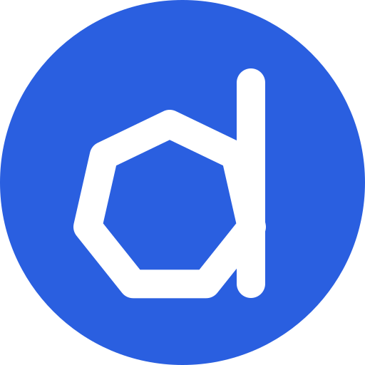

# k8s-dencer


[](https://github.com/atedgimo/k8s-dencer/actions/workflows/ci.yml)
[](LICENSE)
[](go.mod)
[](charts/k8s-dencer/Chart.yaml)

**Node consolidation for Kubernetes, with the decision left to you.**

k8s-dencer works out which nodes your cluster could give back, explains what
moving each workload would cost, and waits for a human to approve it.

---

## The problem

Most clusters run at a fraction of what they are paying for. The pods are spread
across more nodes than they need, and nothing moves them, because moving them
safely means reasoning about PodDisruptionBudgets, topology spread, affinity
rules, taints and single-replica workloads all at once.

The existing answers are autonomous. Karpenter consolidates and the Descheduler
evicts, both on their own schedule. That is the right design for a great many
teams — and unacceptable for the ones running workloads where an unplanned
eviction is an incident, who need to know in advance exactly which pods move and
what could go wrong.

**k8s-dencer produces the plan and stops.** It is a decision-support tool that
happens to be able to execute, not an autoscaler with a UI.

## What it does

- **Reads the whole constraint picture** — PDBs, topology spread, pod and node
  affinity, taints and tolerations, controller ownership, local storage — and
  tells you *why* any given pod cannot move, in words.
- **Plans a consolidation** as an ordered list of discrete steps, each one
  draining a single node.
- **Rates every step Green, Yellow or Red** with the reasoning attached, so the
  risky ones are visible before anyone clicks anything.
- **Executes only what you pick**, through the Kubernetes eviction API, so the
  API server itself enforces your PodDisruptionBudgets.
- **Or closes the loop, inside bounds you set.** `dencer converge` re-plans
  from *observed* state after every drain — one step at a time, full Safety
  Guard each round — until nothing worthwhile remains or your envelope (max
  nodes, max impact) is reached. You approve a policy with explicit bounds,
  never an open-ended "optimize".
- **Refuses steps that became unsafe** between planning and execution, naming
  the rule that stopped it.
- **Checks whether draining actually saved anything.** k8s-dencer never deletes
  a node — something else does — so it watches, and tells you when a node you
  drained is still sitting there.
- **Answers questions in natural language** through an optional Kagent agent
  that quotes the analyzer rather than re-deriving anything.
- **Answers the adjacent questions the same engine can.** `dencer preflight`
  — will a node-pool rotation wedge, and on which pod; `dencer audit` — what
  cannot survive a node loss; `dencer whatif --without-zone b` — does
  everything still fit, CI-gateable; `dencer rightsizing` — requests versus
  *measured* usage; `dencer drain <node>` — kubectl drain with the rails.
- **Works without the UI.** `dencer` (also a `kubectl` plugin) does everything
  the UI does from a terminal, with `-o json` for pipelines — see
  [docs/cli.md](docs/cli.md).

**Execution is off by default.** Until you set `executor.enabled=true`, no
component in the release can cordon, evict, or write to a node — and `make lint`
fails the build if `pods/eviction` appears on any role but the executor's.

## How it works


Four workloads, deliberately separated:

| Component | Does | Can it change your cluster? |
|---|---|---|
| **planner** | Watches state, analyzes constraints, produces plans | No — read-only |
| **ui-backend** | Serves the API, authenticates and authorizes every request | No — read-only |
| **ui-frontend** | The operator's view | No |
| **executor** | Cordons and evicts, one step at a time | **Yes** — and only when enabled |

**The component reachable over the network cannot evict; the one that can evict
has no Service.** The executor is unreachable from outside the cluster by
construction rather than by configuration, and chart lint assertions hold both
halves of that in place.

The domain model has no Kubernetes imports at all, which is why the planner can
be tested against a YAML snapshot and benchmarked at 50,000 pods with no cluster
running.

## Quick start

**Prerequisites:** a Kubernetes cluster, Docker, Helm 3.8+, Go 1.26+, Node 22+.

No real workloads required — the demo stands up a fabric of fake nodes with
[KWOK](https://kwok.sigs.k8s.io/).

```bash
make demo     # fake-node fabric + 30-node topology + build images + install
make token    # mint an operator token
make ui       # port-forward and print the URL
```

Then open the printed URL.

Or skip the browser entirely:

```bash
make cli-install                       # installs dencer and kubectl-dencer
export DENCER_TOKEN="$(make -s token)"
dencer plan                            # or: kubectl dencer plan
```

`dencer` finds the backend through your kubeconfig on its own — no
port-forward, no flags. See **[docs/cli.md](docs/cli.md)**.

To clean up:

```bash
make fabric-reset   # uncordon every fake node after an executor run
make down           # remove every release this repo installs
```

`make` with no target lists everything. Full detail in
**[docs/install.md](docs/install.md)**.

## Installing on a real cluster

```bash
helm install k8s-dencer oci://ghcr.io/atedgimo/charts/k8s-dencer \
  --namespace k8s-dencer --create-namespace \
  --set auth.enabled=true
```

Execution stays off unless you ask for it, and the chart refuses to enable it
without authentication and persistence:

```bash
--set executor.enabled=true --set auth.enabled=true --set persistence.enabled=true
```

## Safety model

The reason to trust this with a production cluster is that the dangerous parts
are narrow, explicit, and tested.

- **Eviction, never deletion.** Steps go through the `policy/v1` eviction
  subresource, so PodDisruptionBudgets are enforced by the API server rather than
  by code in this repository. The executor is deliberately not granted
  `delete pods`.
- **No credential store.** Identity is verified by `TokenReview` and permissions
  by `SubjectAccessReview`, both answered by the API server. Your existing RBAC
  and SSO are the authority.
- **Named refusals.** The Safety Guard re-checks live state immediately before
  each action and blocks on a named rule — `PDBHeadroom`, `MinReadyNodes`,
  `MaxNodesPerRun`, `StepFreshness`, `RedRequiresWindow` — recorded in the audit
  trail.
- **Red steps need a window.** High-impact steps stay locked unless a
  `MaintenanceWindow` is open, and window evaluation fails closed.
- **Recovery is judged on readiness, not phase.** A replacement pod that starts
  but fails its probes aborts the step instead of licensing the next drain.
- **Abort means uncordon.** Eviction cannot be undone and nothing here pretends
  otherwise; aborting restores schedulability and stops.

Details, and instructions for verifying the privilege split against your own
cluster rather than taking this page's word for it, in
**[docs/security.md](docs/security.md)** and
**[docs/execution.md](docs/execution.md)**.

## Scale

Measured, not estimated — on synthesised clusters, with no cluster running:

| Pods | Constraint analysis | Planning | Stored per plan | UI payload |
|---|---|---|---|---|
| 916 | 16 ms | 17 ms | 54 KB | 0.24 MB |
| 2,526 | 90 ms | 110 ms | 197 KB | 0.03 MB |
| 5,026 | 298 ms | 466 ms | 609 KB | 0.05 MB |

The UI payload falls rather than rises past 2,526 pods because that is where it
stops sending an element per pod and starts sending occupancy per node — an
individual 6px block conveys nothing at that density anyway. Method, growth
curves and the known ceiling in **[docs/benchmarks.md](docs/benchmarks.md)**.

The field itself has three renderings and picks one by cluster size: **Rack** to
120 nodes, where a pod is an object you can point at; **Wells** to 600, a level
per node, readable without reading numbers; **Panel** above that, one sorted row
per node. Any of the three can be chosen explicitly and the choice persists.

How full a node is means the **larger of its CPU and memory requests** as a
fraction of allocatable — the dimension that actually limits packing, and the
same one the planner ranks on. Requests, not usage: Kubernetes schedules on what
pods ask for, so a node at 50% requested is half unschedulable however idle its
cores are.

The field also separates **what is observed from what is predicted**. Facts
about the real cluster — a node cordoned, NotReady, drained and awaiting
removal, or actually reclaimed — are worded on the node itself and hold still
while the scrubber animates the plan's forecast over them. During a run the
executor's own event trail marks cordons and drains as they genuinely happen.

## Documentation

| | |
|---|---|
| [Installation and configuration](docs/install.md) | Chart values, profiles, and the constraints each choice carries |
| [CLI](docs/cli.md) | `dencer` and `kubectl dencer`, for operators who don't want the UI |
| [Architecture](docs/architecture.md) | Components, analyzer, planner, impact ratings, API, UI |
| [Authentication and authorization](docs/security.md) | Token delegation, OIDC/SSO, verifying the privilege split |
| [Execution and safety](docs/execution.md) | Per-step behaviour, the guard's rails, maintenance windows, audit |
| [Observability](docs/observability.md) | Prometheus metrics per component |
| [Development](docs/development.md) | Local loop, KWOK fabric, CI gates, releases |
| [Benchmarks](docs/benchmarks.md) | Measured cost, growth curves, the ceiling |
| [Product roadmap](docs/product-roadmap.md) | Shipped capabilities and what comes next, as features |
| [Engineering roadmap](docs/roadmap.md) | The milestone history — built, planned, and deliberately dropped |
| [Design document](docs/k8s-consolidation-agent-architecture.md) | The original architecture and its reasoning |

## Status

**Phases 1–3 are complete**: analysis and explanation, authenticated on-request
execution, and maintenance windows. Phase 4 — hardening toward 1000 nodes and
50,000 pods — is in progress, with metrics, CI and the release pipeline landed.

**v0.1.0 is published** — images and chart on `ghcr.io`, installable by the
command above.

Every release is verified end to end before it ships: CI stands up a five-node
k3d cluster with PodSecurity enforcing `restricted`, installs the chart behind a
real ingress controller on a named StorageClass, plans against real workloads
with real readiness probes, drains a node through the eviction API, asserts the
workload came back Ready, then deletes the node and confirms the reclamation
was observed. That is what
[`make e2e`](hack/e2e.sh) does, and it runs on every pull request.

**It has now run against a real cloud cluster.** `make cloud-e2e` stands up a
five-node GKE cluster, installs the published images, drains a node, and then
waits — touching nothing — while **Google's own cluster autoscaler** decides the
node is unneeded and removes it. Observed and timed at **11m9s** on
2026-07-31. That is the reclamation loop confirmed against a reclaimer nobody
here wrote, which is the one thing k3d structurally cannot prove.

Still unproven, and worth saying: this has not run against anyone's
*production* cluster, only a throwaway one. Workload Identity and IRSA remain
half-tested — the chart's annotations render and are accepted, but k8s-dencer
makes no cloud API calls, so there is no credential path to exercise.

Treat the read-only path as ready to try, and the executor as something to
enable deliberately, on something you can afford to be wrong about.

Full milestone history in [docs/roadmap.md](docs/roadmap.md).

## Security

Found a vulnerability? Please report it privately through
[GitHub's private reporting](https://github.com/atedgimo/k8s-dencer/security/advisories/new)
rather than opening an issue — see [SECURITY.md](SECURITY.md) for scope and
what to expect.

## Contributing

Issues and pull requests are welcome. `make test` and `make lint` are the gates,
and both run in CI on every pull request — the chart contract is strict on
purpose, since it encodes the security properties above.

## License

[MIT](LICENSE) — Copyright (c) 2026 Moti Atedgi.

Use it, fork it, ship it commercially; keep the copyright notice. No warranty,
which is worth reading literally for a tool that can evict pods: the safety rails
here are real and tested, but you are the one accountable for what runs against
your cluster.
